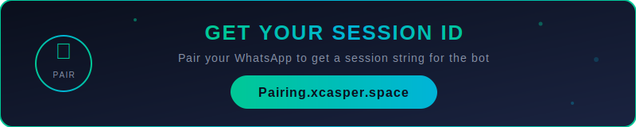
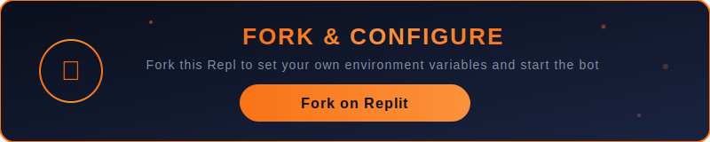

<p align="center">
  
</p>

<p align="center">
  
</p>

<p align="center">
  <b>Multi-Device WhatsApp Bot</b><br>
  <i>by CASPER TECH KENYA DEVELOPERS</i>
</p>

<p align="center">
  <a href="https://replit.com/refer/johnmainaengie"></a>
  <a href="#heroku"></a>
  <a href="#railway"></a>
  <a href="#vps"></a>
  <a href="#termux"></a>
  <a href="#pterodactyl"></a>
  <a href="#render"></a>
</p>

<p align="center">
  <a href="https://whatsapp.com/channel/0029VbCK8vlKwqSSkFkC1l2k"></a>
  <a href="https://whatsapp.com/channel/0029Vb6XJQQHrDZi1RzKu90t"></a>
  <a href="https://t.me/casper_tech_ke"></a>
  <a href="https://Pairing.xcasper.space"></a>
</p>

---

## Features

- Multi-device WhatsApp bot support
- Web dashboard for real-time monitoring
- Settings panel for easy configuration
- WhatsApp pairing code directly from web UI
- Bot controls (Start / Stop / Restart)
- Auto database backup and restore
- Heavily encrypted source code
- Deploy anywhere

---

## Get Your Session ID

<p align="center">
  <a href="https://Pairing.xcasper.space">
    
  </a>
</p>

<p align="center">
  <b>You need a session ID to run the bot.</b><br>
  Visit <a href="https://Pairing.xcasper.space"><b>Pairing.xcasper.space</b></a> to pair your WhatsApp and get your session string.<br>
  Then paste it in the <code>SESSION</code> environment variable or in the Settings panel.
</p>

---

## Start the Bot

<p align="center">
  
</p>

<p align="center">
  After setting your session ID, start the bot by clicking <b>Run</b> on Replit or running:<br><br>
  <code>node index.js</code><br><br>
  The web dashboard will be available at your Repl's URL on port <code>5000</code>.
</p>

---

## Fork & Configure

<p align="center">
  <a href="https://replit.com/refer/johnmainaengie">
    
  </a>
</p>

<p align="center">
  <b>Fork this Repl to get your own copy and set your environment variables.</b><br>
  After forking, go to the <b>Secrets</b> tab and add your <code>SESSION</code>, <code>OWNER_NUMBERS</code>, and other variables.<br>
  Then hit <b>Run</b> to start the bot.
</p>

<p align="center">
  <a href="https://replit.com/refer/johnmainaengie"></a>
</p>

---

## Environment Variables

| Variable | Description | Default |
|----------|-------------|---------|
| `SESSION` | WhatsApp session string | _(required)_ |
| `OWNER_NUMBERS` | Comma-separated owner numbers | |
| `OWNER_NAME` | Owner display name | `XyrooRynzz` |
| `BOT_NAME` | Bot display name | `CASPER-XD ULTRA` |
| `BOT_MODE` | `public` or `self` | `public` |
| `PREFIX` | Command prefix | `.` |
| `TIMEZONE` | Timezone | `Africa/Nairobi` |
| `WELCOME` | Welcome messages | `false` |
| `ADMIN_EVENT` | Admin event notifications | `false` |
| `AUTO_VIEW` | Auto-view statuses | `false` |
| `AUTO_REACT` | Auto-react to statuses | `false` |
| `PACK_NAME` | Sticker pack name | Bot name |
| `STICKER_AUTHOR` | Sticker author text | Owner name |
| `PORT` | Server port | `5000` |

---

## Deployment Guides

<a id="replit"></a>

### Replit (Recommended)

The easiest way to deploy. Click the button below to get started:

[](https://replit.com/refer/johnmainaengie)

1. Sign up or log in at [Replit](https://replit.com/refer/johnmainaengie)
2. Create a new Repl and import this repository
3. Go to the **Settings** page in the web dashboard to configure your bot
4. The bot starts automatically on run
5. Use the **Pairing** section to link your WhatsApp if you don't have a session string

---

<a id="heroku"></a>

### Heroku

1. Create a [Heroku](https://heroku.com) account
2. Install the Heroku CLI:
   ```bash
   curl https://cli-assets.heroku.com/install.sh | sh
   ```
3. Clone and deploy:
   ```bash
   git clone <this-repo-url> casper-ultra
   cd casper-ultra
   heroku create your-app-name
   heroku stack:set container
   git push heroku main
   ```
4. Set environment variables:
   ```bash
   heroku config:set SESSION="your-session-string"
   heroku config:set OWNER_NUMBERS="254xxxxxxxxx"
   heroku config:set OWNER_NAME="YourName"
   ```
5. Open your app:
   ```bash
   heroku open
   ```

**Using Heroku Dashboard:**
1. Go to [Heroku Dashboard](https://dashboard.heroku.com)
2. Click **New** > **Create new app**
3. Connect your GitHub repo or use Heroku Git
4. Go to **Settings** > **Config Vars** and add your environment variables
5. Deploy from the **Deploy** tab

---

<a id="railway"></a>

### Railway

1. Sign up at [Railway](https://railway.app)
2. Click **New Project** > **Deploy from GitHub repo**
3. Select this repository
4. Railway auto-detects the config from `railway.json`
5. Add environment variables in the **Variables** tab:
   - `SESSION` = your session string
   - `OWNER_NUMBERS` = your phone numbers
   - `PORT` = 5000
6. Railway will build and deploy automatically
7. Access your dashboard via the provided URL

**One-click deploy:**
```bash
npm install -g @railway/cli
railway login
railway init
railway up
```

---

<a id="vps"></a>

### VPS (Ubuntu/Debian)

SSH into your server and run:

```bash
# Install dependencies
sudo apt update && sudo apt install -y git nodejs npm

# Install Node.js 20 (if not already)
curl -fsSL https://deb.nodesource.com/setup_20.x | sudo -E bash -
sudo apt install -y nodejs

# Clone the repository
git clone <this-repo-url> casper-ultra
cd casper-ultra

# Install packages
npm install --production

# Set environment variables
export SESSION="your-session-string"
export OWNER_NUMBERS="254xxxxxxxxx"
export PORT=5000

# Run with PM2 (recommended for production)
npm install -g pm2
pm2 start index.js --name casper-ultra
pm2 save
pm2 startup
```

**Using Docker on VPS:**

```bash
git clone <this-repo-url> casper-ultra
cd casper-ultra

# Build and run
docker build -t casper-ultra .
docker run -d \
  --name casper-ultra \
  -p 5000:5000 \
  -e SESSION="your-session-string" \
  -e OWNER_NUMBERS="254xxxxxxxxx" \
  -e OWNER_NAME="YourName" \
  --restart unless-stopped \
  casper-ultra
```

**Using Docker Compose:**

Create `docker-compose.yml`:
```yaml
version: '3.8'
services:
  casper-ultra:
    build: .
    ports:
      - "5000:5000"
    environment:
      - SESSION=your-session-string
      - OWNER_NUMBERS=254xxxxxxxxx
      - OWNER_NAME=YourName
      - BOT_MODE=public
    restart: unless-stopped
```

Then run:
```bash
docker-compose up -d
```

---

<a id="termux"></a>

### Termux (Android)

1. Install Termux from [F-Droid](https://f-droid.org/en/packages/com.termux/)

2. Set up the environment:
   ```bash
   pkg update && pkg upgrade -y
   pkg install -y git nodejs
   ```

3. Clone and install:
   ```bash
   git clone <this-repo-url> casper-ultra
   cd casper-ultra
   npm install --production
   ```

4. Create your `.env` file:
   ```bash
   cat > .env << 'EOF'
   SESSION=your-session-string
   OWNER_NUMBERS=254xxxxxxxxx
   OWNER_NAME=YourName
   BOT_NAME=CASPER-XD ULTRA
   BOT_MODE=public
   PREFIX=.
   TIMEZONE=Africa/Nairobi
   WELCOME=false
   ADMIN_EVENT=false
   AUTO_VIEW=false
   AUTO_REACT=false
   PACK_NAME=CASPER-XD ULTRA
   STICKER_AUTHOR=© YourName
   EOF
   ```

5. Run the bot:
   ```bash
   node index.js
   ```

6. Keep running in background:
   ```bash
   # Option 1: Using nohup
   nohup node index.js &

   # Option 2: Using tmux
   pkg install tmux
   tmux new -s casper
   node index.js
   # Press Ctrl+B then D to detach
   # tmux attach -t casper to reattach
   ```

7. Access dashboard at `http://localhost:5000`

**Auto-start on Termux boot:**
```bash
mkdir -p ~/.termux/boot
cat > ~/.termux/boot/start-casper.sh << 'EOF'
#!/data/data/com.termux/files/usr/bin/sh
cd ~/casper-ultra && node index.js &
EOF
chmod +x ~/.termux/boot/start-casper.sh
```

---

<a id="pterodactyl"></a>

### Pterodactyl Panel

1. **Import the egg:**
   - Go to your Pterodactyl admin panel
   - Navigate to **Nests** > **Import Egg**
   - Upload the `egg.json` file from this repository

2. **Create a server:**
   - Go to **Servers** > **Create New**
   - Select the **CASPER-XD ULTRA** egg
   - Allocate resources (recommended: 512MB RAM, 10GB disk)
   - Set the port allocation

3. **Upload files:**
   - Use SFTP or the file manager to upload all project files to the server
   - Or use the startup command which will auto-install

4. **Configure variables:**
   - Go to **Startup** tab in the server panel
   - Set your `SESSION`, `OWNER_NUMBERS`, and other variables

5. **Start the server** from the console tab

---

<a id="render"></a>

### Render

1. Sign up at [Render](https://render.com)
2. Click **New** > **Web Service**
3. Connect your GitHub repository
4. Render auto-detects config from `render.yaml`
5. Or configure manually:
   - **Runtime:** Node
   - **Build Command:** `npm install --production`
   - **Start Command:** `node index.js`
6. Add environment variables in the **Environment** tab:
   - `SESSION` = your session string
   - `OWNER_NUMBERS` = your phone numbers
7. Click **Deploy**

**One-click via Blueprint:**
- Push this repo to GitHub, then go to `https://render.com/deploy` and connect the repo. Render will auto-configure from the `render.yaml` file.

---

## Get Session String

You can get your session string from:

1. **Online:** Visit [Pairing.xcasper.space](https://Pairing.xcasper.space) to get a session string
2. **From the Web Dashboard:** Go to Settings > WhatsApp Pairing > Enter your phone number > Get the pairing code > Link in WhatsApp
3. **Direct pairing:** Start the bot without a session, use the web UI pairing feature

---

## Support

- WhatsApp Channel 1: [Join Here](https://whatsapp.com/channel/0029VbCK8vlKwqSSkFkC1l2k)
- WhatsApp Channel 2: [Join Here](https://whatsapp.com/channel/0029Vb6XJQQHrDZi1RzKu90t)
- Telegram: [@casper_tech_ke](https://t.me/casper_tech_ke)
- Session Pairing: [Pairing.xcasper.space](https://Pairing.xcasper.space)
- Deploy on Replit: [Get Started](https://replit.com/refer/johnmainaengie)

---

<p align="center">
  <b>&copy; 2024 - 2026 CASPER TECH KENYA DEVELOPERS. All rights reserved.</b>
</p>
